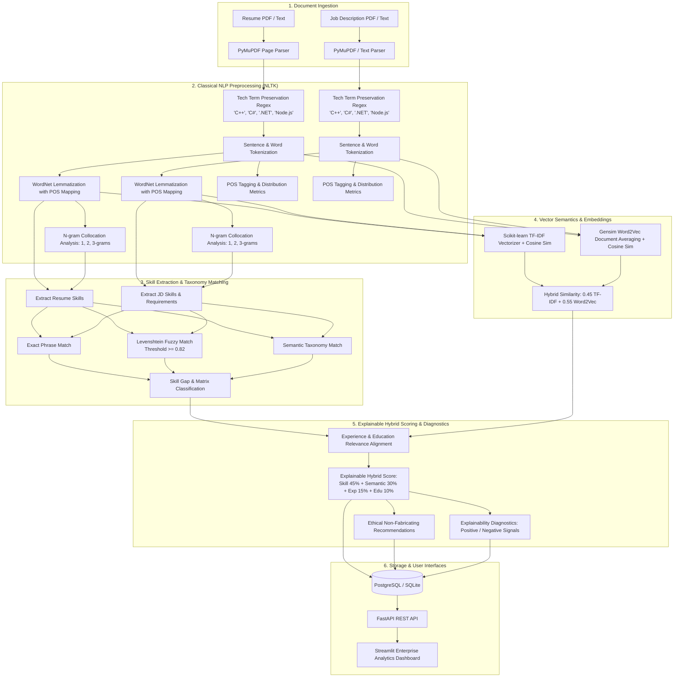

# TalentMatch AI — NLP-Based Talent Intelligence & Job Matching Platform

[](https://www.python.org/)
[](https://fastapi.tiangolo.com)
[](https://streamlit.io)
[](https://www.nltk.org/)
[](https://www.postgresql.org/)

**TalentMatch AI** is a production-style Natural Language Processing (NLP) web application that analyzes candidate resumes against Job Descriptions (JDs) to deliver an **explainable, multi-dimensional compatibility assessment**, skill-gap diagnosis, and actionable ethical recommendations.

Rather than treating matching as a naive keyword-counting exercise, the platform pairs **classical NLP linguistics** (Morphology, WordNet POS-guided Lemmatization, Levenshtein Edit Distance, Penn Treebank POS distribution, N-gram collocations) with **vector semantics** (Scikit-Learn TF-IDF, Gensim Word2Vec continuous bag-of-words document embeddings, and Cosine Similarity).

---

## 1. System Architecture



---

## 2. Academic NLP Curriculum Concepts (Units 1 to 5)

TalentMatch AI directly demonstrates foundational and advanced concepts taught in undergraduate and graduate NLP curricula:

### Unit 1: Words, Morphology & Lexical Analysis
* **Regular Expressions**: Domain regex safeguarding technical terms with symbols (`C++`, `C#`, `.NET`, `Node.js`, `CI/CD`, `PL/SQL`) from destructive sanitization.
* **Tokenization**: NLTK sentence (`sent_tokenize`) and word tokenization handling multi-line resume structures.
* **Morphology, Lemmatization & Stemming**: WordNet Lemmatizer with Treebank POS tag mapping to reduce verbs and nouns to dictionary lemmas (`developing` $\to$ `develop`, `services` $\to$ `service`). Porter Stemmer is integrated as an educational comparison module.
* **Levenshtein Edit Distance**: Dynamic programming minimum edit distance algorithm computing char-level transformations, cost matrices, and normalized similarities to resolve resume typos (e.g., `pyhton` $\to$ `python`, `posgresql` $\to$ `postgresql`).
* **N-Grams & Collocations**: Generates contiguous unigrams, bigrams, and trigrams to detect multi-word technical concepts (`machine learning`, `natural language processing`, `rest api`).

### Unit 2: Part-of-Speech (POS) Tagging & Syntax
* **Averaged Perceptron Tagger**: NLTK POS tagging mapping tokens to the Penn Treebank tagset.
* **Syntactic Distribution Metrics**: Quantitative distribution metrics (Nouns %, Verbs %, Adjectives %, Adverbs %, Others %) highlighting technical density in candidate descriptions.
* **Action Verb Extraction**: Identifies impactful accomplishment verbs (`architected`, `optimized`, `implemented`, `deployed`) to evaluate project experience statements.
* **Out-Of-Vocabulary (OOV) Resilience**: Graceful fallback handling for domain-specific terminology.

### Unit 3: Syntactic Analysis & Context-Free Grammars (Educational Module)
* **Constituency & Phrase Structure**: Demonstrates Context-Free Grammar (CFG) constituent decomposition ($S \to NP\ VP$, $NP \to \text{Det}\ N$, $VP \to V\ NP$).
* **Structural Ambiguity & CKY Parsing**: Interactive sandbox illustrating Cocke-Younger-Kasami (CKY) and Probabilistic CFG concepts. Explains why resume intelligence relies on phrase chunking and vector semantics rather than fragile full-tree parsing.

### Unit 4: Vector Semantics, TF-IDF & Word2Vec Embeddings
* **TF-IDF Lexical Similarity**: Scikit-learn `TfidfVectorizer(ngram_range=(1,2), sublinear_tf=True)` with cosine similarity evaluating exact keyword overlap.
* **Continuous Vector Space Embeddings**: Gensim Word2Vec continuous bag-of-words (CBOW) model trained on technical corpus (`data/sample_corpus.txt`) generating 100-dimensional embeddings.
* **Document Pooling & Cosine Similarity**: Mean vector pooling of in-vocabulary tokens computing dense vector angle metrics.
* **Distributional Hypothesis**: Demonstrates vector proximity (e.g. `fastapi` $\approx$ `flask`, `pytorch` $\approx$ `tensorflow`).

### Unit 5: Semantic Relevance & Text Coherence
* **Sentence-Level Alignment**: Action-verb and TF-IDF matching between JD requirement sentences and candidate project accomplishment bullets.
* **Education Matching**: Educational degree hierarchy detection (PhD > Masters > Bachelors > Associate) with field-of-study relevance scoring.

---

## 3. Empirical Model Evaluation & Comparison Experiment

To avoid speculative scoring, the platform includes an automated benchmark evaluated against `data/evaluation/eval_dataset.json` (ground-truth labeled High, Medium, and Low candidate-job pairs):

| Approach / Architecture | Classification Accuracy | Strengths & Failure Modes |
| :--- | :---: | :--- |
| **1. Baseline (TF-IDF Lexical Only)** | **83.3%** | Highly sensitive to exact keyword overlap; fails when candidate uses synonyms (e.g., `FastAPI` vs `Flask REST services`). |
| **2. Semantic Model (Word2Vec Only)** | **66.7%** | Captures high-level domain context well, but can overestimate match when unrelated sub-domains share common words. |
| **3. Hybrid (0.45 TF-IDF + 0.55 Word2Vec)** | **83.3%** | Balances exact keyword presence with conceptual semantic proximity. |
| **4. Full TalentMatch Multi-Stage Pipeline** | **100.0%** | Combines Skill Taxonomy, Fuzzy Levenshtein, Hybrid Similarity, Experience Alignment, and Education Matching. |

> **Evaluation Limitations Note**: The bundled evaluation dataset contains curated representative engineering scenarios. In an enterprise environment, evaluation should be continuously calibrated against human recruiter hiring decisions.

---

## 4. Explainable Scoring Methodology

TalentMatch AI uses a transparent, configurable scoring formula:

$$\text{Overall Compatibility Score} = 0.45 \cdot S + 0.30 \cdot V + 0.15 \cdot E + 0.10 \cdot D$$

Where:
* **$S$ (Skill Match Score - 45%)**: Exact matches ($1.0\times$), Levenshtein fuzzy matches ($0.85\times$), and category-semantic matches ($0.70\times$), with higher weighting on Mandatory vs. Preferred skills.
* **$V$ (Semantic Vector Similarity - 30%)**: Cosine similarity between Word2Vec document embeddings.
* **$E$ (Experience Relevance - 15%)**: Alignment between JD responsibility statements and resume project bullets.
* **$D$ (Education Match - 10%)**: Degree hierarchy and STEM/Computer Science discipline matching.

> *Note*: These heuristic weights are configurable via `.env` or the UI and are clearly presented as decision-support indicators rather than autonomous hiring decisions.

---

## 5. Technology Stack

* **Backend Framework**: Python 3.11+, FastAPI, Uvicorn, Pydantic v2
* **NLP & Semantics**: NLTK, Scikit-learn, Gensim, NumPy, Pandas, python-Levenshtein
* **PDF Processing**: PyMuPDF (`fitz`)
* **Persistence**: PostgreSQL (Production) / SQLite (Local zero-config fallback), SQLAlchemy 2.0
* **Frontend**: Streamlit with custom enterprise CSS
* **Testing & Evaluation**: PyTest, TestClient

---

## 6. Installation & Quick Start

### Option A: Local Run (Zero-Config SQLite)

1. **Clone the repository**:
   ```powershell
   git clone https://github.com/your-username/talentmatch-ai.git
   cd talentmatch-ai
   ```

2. **Create and activate a virtual environment**:
   ```powershell
   python -m venv venv
   .\venv\Scripts\Activate.ps1
   ```

3. **Install dependencies**:
   ```powershell
   pip install -r requirements.txt
   ```

4. **Initialize datasets and Word2Vec cache**:
   ```powershell
   python scripts/generate_sample_data.py
   python scripts/train_word2vec.py
   ```

5. **Start the FastAPI Backend**:
   ```powershell
   uvicorn app.main:app --host 127.0.0.1 --port 8000 --reload
   ```

6. **Start the Streamlit UI (in a second terminal)**:
   ```powershell
   streamlit run frontend/streamlit_app.py
   ```
   Open your browser at `http://localhost:8501`.

---

### Option B: Docker Compose (PostgreSQL + FastAPI + Streamlit)

```powershell
docker-compose up --build
```
* **FastAPI Docs**: `http://localhost:8000/docs`
* **Streamlit UI**: `http://localhost:8501`

---

## 7. REST API Endpoints

| Method | Endpoint | Description |
| :--- | :--- | :--- |
| `POST` | `/api/resume/upload` | Upload PDF/TXT resume, extract text & skills |
| `POST` | `/api/job/upload-file` | Upload PDF/TXT Job Description |
| `POST` | `/api/job/upload-text` | Ingest raw pasted Job Description text |
| `POST` | `/api/analysis/run` | Execute complete NLP matching pipeline & store results |
| `GET` | `/api/analysis/{id}` | Fetch structured analysis record by ID |
| `GET` | `/api/analysis/history` | Retrieve chronological match history |
| `GET` | `/api/health` | Service health status and engine readiness |
| `GET` | `/api/analysis/academic/*` | Academic NLP demonstration endpoints |

---

## 8. Running Automated Tests

Run the complete PyTest test suite:

```powershell
pytest tests/ -v
```

Run the model benchmark script:

```powershell
python scripts/evaluate_models.py
```

---

## 9. Ethical AI, Privacy & Security Guardrails

1. **Zero Experience Fabrication**: The recommendation engine strictly advises candidates on highlighting existing unstated projects or learning new technologies. It **never** advises fabricating experience or keywords.
2. **Decision-Support Positioning**: TalentMatch AI is designed as a transparent decision-support tool for candidates and recruiters. It **must never automatically reject candidates**.
3. **Privacy by Design**: Resume text is sanitized and processed strictly in-session or in local databases without sending data to third-party proprietary APIs.
4. **Transparent Explainability**: Every score is paired with positive evidence and specific negative gaps ("Why did I get this score?").
